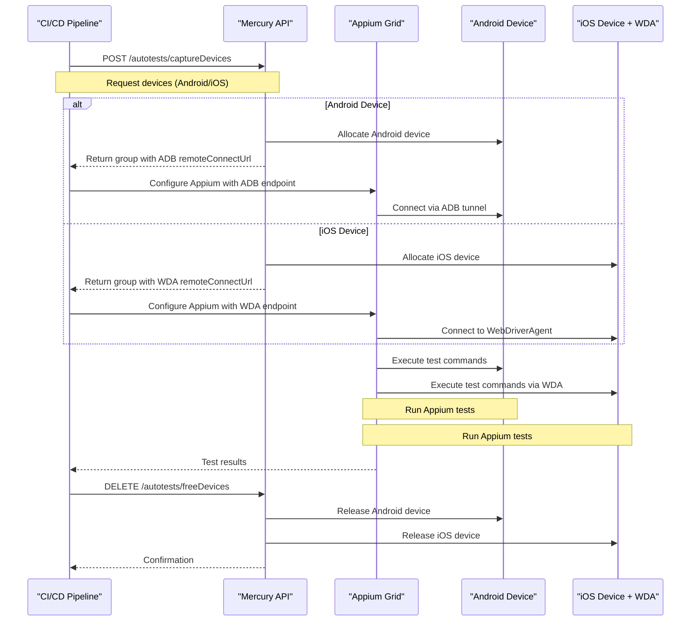

# Automation and Appium Tests

# Use Mercury for Appium Tests

Mercury provides a unified autotest API that works with both Android and iOS devices for Appium Grid integration. 
The key difference is that Android devices use ADB connections while iOS devices use WebDriverAgent (WDA) connections, both exposed through the `remoteConnectUrl` field.

### Unified Sequence Diagram



### API Endpoints and curl Examples

#### 1. Capture Devices

**Endpoint**: `GET /api/v1/autotests`

**Android devices:**
```bash
curl -H "Authorization: Bearer YOUR-TOKEN-HERE" \
  "https://mercury.example.com/api/v1/autotests?amount=2&timeout=600&run=Android-Test-Run&need_amount=true&abi=armeabi-v7a&type=android"
```

**iOS devices:**
```bash
curl -H "Authorization: Bearer YOUR-TOKEN-HERE" \
  "https://mercury.example.com/api/v1/autotests?amount=1&timeout=600&run=iOS-Test-Run&need_amount=true&type=ios"
```

**Parameters** :
- `amount`: Number of devices (required)
- `timeout`: Timeout in seconds (required, max 3 hours)
- `run`: Test run identifier (required)
- `need_amount`: Strictly enforce device count
- `abi`: CPU architecture (Android)
- `type`: Device type (android/ios)
- `model`, `sdk`, `version`: Additional filters

#### 2. Release Devices

**Endpoint**: `DELETE /api/v1/autotests`

```bash
curl -X DELETE -H "Authorization: Bearer YOUR-TOKEN-HERE" \
  "https://mercury.example.com/api/v1/autotests?group=GROUP_ID_FROM_CAPTURE_RESPONSE"
```

### Python Code Examples

Use direct HTTP clients (curl, requests, Appium client libraries) for API access.

#### Authentication Setup
```python
from mercury_client import AuthenticatedClient

client = AuthenticatedClient(
    base_url="https://your-mercury.com",
    token="your-access-token"
)
```

#### Device Capture (Both Platforms)
```python
from mercury_client.api.autotests import capture_devices

# Android devices
android_response = capture_devices.sync_detailed(
    client=client,
    timeout=600,
    amount=2,
    need_amount=True,
    abi='armeabi-v7a',
    type='android',
    run='Android-Test-run-example'
)

# iOS devices  
ios_response = capture_devices.sync_detailed(
    client=client,
    timeout=600,
    amount=1,
    need_amount=True,
    type='ios',
    run='iOS-Test-run-example'
)
```

#### Extract Connection Information
```python
def extract_device_info(response):
    if response.parsed.success:
        group = response.parsed.group
        devices_info = []
        
        for device in group.devices:
            if device.ios:
                # iOS: WDA connection URL
                connection_info = {
                    'platform': 'iOS',
                    'udid': device.serial,
                    'wda_url': device.remoteConnectUrl,  # e.g., "http://192.168.1.100:8100"
                    'model': device.model
                }
            else:
                # Android: ADB connection URL
                connection_info = {
                    'platform': 'Android',
                    'serial': device.serial,
                    'adb_url': device.remoteConnectUrl,  # e.g., "192.168.1.100:5555"
                    'model': device.model
                }
            devices_info.append(connection_info)
        
        return devices_info, group.id
    return None, None
```

#### Appium Grid Configuration
```python
from appium import webdriver

def create_appium_driver(device_info, appium_hub_url):
    if device_info['platform'] == 'Android':
        # Android configuration
        adb_host, adb_port = device_info['adb_url'].split(':')
        desired_caps = {
            'platformName': 'Android',
            'deviceName': device_info['model'],
            'udid': device_info['serial'],
            'adbHost': adb_host,
            'adbPort': int(adb_port),
            'automationName': 'UiAutomator2'
        }
    else:
        # iOS configuration
        wda_port = device_info['wda_url'].split(':')[-1]
        desired_caps = {
            'platformName': 'iOS',
            'deviceName': device_info['model'],
            'udid': device_info['udid'],
            'wdaRemotePort': int(wda_port),
            'usePrebuiltWDA': True,
            'automationName': 'XCUITest'
        }
    
    return webdriver.Remote(appium_hub_url, desired_caps)
```

#### Device Release
```python
from mercury_client.api.autotests import free_devices

def release_devices(client, group_id):
    response = free_devices.sync_detailed(
        client=client,
        group=group_id
    )
    return response.parsed.success if response.parsed else False
```

### Complete Integration Example

```python
def run_appium_tests_with_mercury():
    # 1. Setup client
    client = AuthenticatedClient(
        base_url="https://your-mercury.com",
        token="your-access-token"
    )
    
    # 2. Capture devices (mixed Android/iOS)
    android_response = capture_devices.sync_detailed(
        client=client, timeout=600, amount=1, 
        type='android', run='Mixed-Test-Run'
    )
    
    ios_response = capture_devices.sync_detailed(
        client=client, timeout=600, amount=1,
        type='ios', run='Mixed-Test-Run-iOS'
    )
    
    try:
        # 3. Extract device information
        android_devices, android_group_id = extract_device_info(android_response)
        ios_devices, ios_group_id = extract_device_info(ios_response)
        
        # 4. Create Appium drivers
        drivers = []
        for device in android_devices + ios_devices:
            driver = create_appium_driver(device, 'http://appium-grid:4444/wd/hub')
            drivers.append(driver)
        
        # 5. Run your tests
        for driver in drivers:
            # Your test logic here
            driver.find_element_by_id("some-element").click()
            
    finally:
        # 6. Cleanup
        for driver in drivers:
            driver.quit()
        
        if android_group_id:
            release_devices(client, android_group_id)
        if ios_group_id:
            release_devices(client, ios_group_id)
```

### Platform-Specific Implementation Details

**Android**: Uses ADB connections exposed through `remoteConnectUrl` 

**iOS**: Requires WebDriverAgent setup and uses `pymobiledevice3` for port forwarding. The iOS provider handles WDA connectivity automatically.

### Authentication

Generate access tokens from Mercury UI (Settings → Keys):

```bash
curl -H "Authorization: Bearer YOUR-TOKEN-HERE" \
  https://mercury.example.com/api/v1/user
```

## Notes

The unified API works seamlessly for both platforms through the same endpoints, with Mercury automatically handling the underlying protocol differences (ADB vs WDA). Regular users are limited to 2 devices per test run. The system supports device filtering by architecture, model, SDK level, and platform type for precise device allocation.

## Ruby Example (Single Device)

The following Ruby script captures one Android device, runs your test command, then releases the device.

```ruby
require 'json'
require 'net/http'
require 'uri'

BASE_URL = ENV.fetch('MERCURY_BASE_URL') # e.g. https://mercury.example.com
TOKEN = ENV.fetch('MERCURY_TOKEN')

def request(method:, path:, params: {})
    uri = URI("#{BASE_URL}#{path}")
    uri.query = URI.encode_www_form(params) unless params.empty?

    http = Net::HTTP.new(uri.host, uri.port)
    http.use_ssl = uri.scheme == 'https'

    klass = {
        get: Net::HTTP::Get,
        delete: Net::HTTP::Delete
    }.fetch(method)

    req = klass.new(uri)
    req['Authorization'] = "Bearer #{TOKEN}"
    req['Content-Type'] = 'application/json'

    res = http.request(req)
    raise "HTTP #{res.code}: #{res.body}" unless res.is_a?(Net::HTTPSuccess)

    JSON.parse(res.body)
end

capture = request(
    method: :get,
    path: '/api/v1/autotests',
    params: {
        amount: 1,
        timeout: 600,
        run: "ruby-run-#{Time.now.to_i}",
        need_amount: true,
        type: 'android'
    }
)

group_id = capture.dig('group', 'id')
device = capture.dig('group', 'devices', 0)
raise 'No device captured' unless group_id && device

serial = device['serial']
remote_url = device['remoteConnectUrl']
puts "Captured device serial=#{serial}, remoteConnectUrl=#{remote_url}"

begin
    # Replace this with your actual test command.
    # Example: system("bundle exec rspec spec/mobile_spec.rb")
    ok = system('echo "Run your Ruby/Appium tests here"')
    raise 'Test command failed' unless ok
ensure
    request(
        method: :delete,
        path: '/api/v1/autotests',
        params: { group: group_id }
    )
    puts "Released group=#{group_id}"
end
```

Run:

```bash
MERCURY_BASE_URL="https://mercury.example.com" \
MERCURY_TOKEN="YOUR_TOKEN" \
ruby mercury_single_device.rb
```

## Azure Pipeline Example (Ruby + Mercury)

```yaml
trigger:
- main

pool:
    vmImage: 'macOS-latest'

variables:
    MERCURY_BASE_URL: 'https://mercury.example.com'

steps:
- task: UseRubyVersion@0
    inputs:
        versionSpec: '3.2'

- script: |
        gem install bundler
        bundle install
    displayName: 'Install Ruby dependencies'

- script: |
        ruby mercury_single_device.rb
    displayName: 'Run Ruby mobile tests on 1 Mercury device'
    env:
        MERCURY_BASE_URL: $(MERCURY_BASE_URL)
        MERCURY_TOKEN: $(MERCURY_TOKEN)
```

Store `MERCURY_TOKEN` as a secret pipeline variable.

# Using the Mercury API to Run Automated Tests

Mercury provides a dedicated API for automated testing, allowing you to capture devices for test runs and release them once the tests are complete.

## Key API Endpoints for Automation

### 1. Capture Devices for Testing

Use the `/autotests/captureDevices` endpoint to allocate a group of devices for an automated test run.

**Request parameters:**
- `amount` – number of devices to capture (required)
- `timeout` – timeout in seconds (required, max 3 hours)
- `run` – test run identifier (required)
- `need_amount` – strictly enforce the requested device count

**Device filters:**
- `abi` – CPU architecture
- `model` – device model
- `type` – device type
- `sdk` – Android SDK level
- `version` – Android version

### 2. Release Devices

Use the `/autotests/freeDevices` endpoint to release the devices after the test run is complete.

## Python Client Usage Example

### Capturing a Device Group

```python
from mercury_client.api.autotests import capture_devices

response = capture_devices.sync_detailed(
    client=api_client,
    timeout=600,
    amount=2,
    need_amount=True,
    abi='armeabi-v7a',
    run='Test-run-example',
    sdk=UNSET,
    model=UNSET,
    type=UNSET,
    version=UNSET
)
```

### Parsing the Response

On success, you'll receive an `AutoTestResponse` object with the following fields:

- `success` – operation status
- `description` – operation details
- `group` – the device group object
- `group.id` – ID of the allocated group
- `group.devices` – list of captured devices

For Android, the key field is `remoteConnectUrl`, which contains the ADB connect URL for remote debugging.
Also for iOS this field contains Appium WDA connect Url

### Releasing Devices

```python
from mercury_client.api.autotests import free_devices

response = free_devices.sync_detailed(
    client=api_client,
    group=autotests_group_id
)
```

## Client Generation from Swagger Schema

Mercury uses OpenAPI/Swagger for its API documentation. The Swagger spec is available at `/api/v1/swagger.json`.

### Auto-Generating a Client

You can generate a client in any supported language using Swagger Codegen:

```bash
# Python
swagger-codegen generate -i https://your-mercury.com/api/v1/swagger.json -l python -o ./mercury-client

# Java
swagger-codegen generate -i https://your-mercury.com/api/v1/swagger.json -l java -o ./mercury-client

# JavaScript
swagger-codegen generate -i https://your-mercury.com/api/v1/swagger.json -l javascript -o ./mercury-client
```

### Using the Prebuilt Python Client

The repo already includes a Python client:

```python
from mercury_client import AuthenticatedClient

client = AuthenticatedClient(
    base_url="https://your-mercury.com",
    token="your-access-token"
)
```

## Authentication

An access token is required to use the API. You can generate one from the Mercury UI under Settings → Keys. Pass the token in the `Authorization` header:

```bash
curl -H "Authorization: Bearer YOUR-TOKEN-HERE" https://mercury.example.com/api/v1/autotests/captureDevices
```

## Limitations

The autotest system in Mercury is built on top of the standard device group infrastructure but provides a simplified API tailored for CI/CD pipelines. Regular users are limited to 2 devices per test run.

---

# Otomasyon ve Appium Testleri [Türkçe]

## Appium Testleri İçin Mercury Kullanımı

Mercury, Appium Grid entegrasyonu için hem Android hem de iOS cihazlarıyla çalışan birleşik (unified) bir otomatik test API'si sağlar.
En önemli fark; Android cihazların ADB bağlantılarını kullanması, iOS cihazların ise WebDriverAgent (WDA) bağlantılarını kullanmasıdır (her ikisi de `remoteConnectUrl` alanı üzerinden sunulur).

### API Uç Noktaları ve curl Örnekleri

#### 1. Cihazları Test İçin Ayırmak (Capture Devices)

**Uç Nokta**: `GET /api/v1/autotests`

**Android cihazlar:**
```bash
curl -H "Authorization: Bearer YOUR-TOKEN-HERE" \
  "https://mercury.example.com/api/v1/autotests?amount=2&timeout=600&run=Android-Test-Run&need_amount=true&abi=armeabi-v7a&type=android"
```

**iOS cihazlar:**
```bash
curl -H "Authorization: Bearer YOUR-TOKEN-HERE" \
  "https://mercury.example.com/api/v1/autotests?amount=1&timeout=600&run=iOS-Test-Run&need_amount=true&type=ios"
```

**Parametreler** :
- `amount`: Cihaz sayısı (zorunlu)
- `timeout`: Saniye cinsinden zaman aşımı (zorunlu, maks 3 saat)
- `run`: Test çalıştırma tanımlayıcısı (zorunlu)
- `need_amount`: İstenilen cihaz sayısını kesin olarak zorla
- `abi`: CPU mimarisi (Android)
- `type`: Cihaz tipi (android/ios)
- `model`, `sdk`, `version`: Ek filtreler

#### 2. Cihazları Serbest Bırakmak (Release Devices)

**Uç Nokta**: `DELETE /api/v1/autotests`

```bash
curl -X DELETE -H "Authorization: Bearer YOUR-TOKEN-HERE" \
  "https://mercury.example.com/api/v1/autotests?group=ALINAN_YANITTAN_GELEN_GRUP_ID"
```

### Python Kodu ile Kullanım

Mercury API'sini kullanabilmek için yukarıda paylaşılan Python kod örneklerinden (`mercury_client` kütüphanesi) yararlanabilirsiniz.

### Platforma Özgü Uygulama Detayları

**Android**: `remoteConnectUrl` üzerinden sağlanan ADB bağlantılarını kullanır.

**iOS**: WebDriverAgent kurulumu gerektirir ve port yönlendirmeleri için `pymobiledevice3` kullanır. iOS sağlayıcısı, WDA bağlantısını otomatik olarak yönetir.

### Kimlik Doğrulama (Authentication)

Mercury arayüzünden (Ayarlar → Anahtarlar) erişim tokenları oluşturabilirsiniz:

```bash
curl -H "Authorization: Bearer BURAYA_TOKEN_YAZIN" \
  https://mercury.example.com/api/v1/user
```

## Notlar

Birleşik API, her iki platform için aynı uç noktalardan (endpoints) sorunsuz çalışır ve Mercury altta yatan protokol farklılıklarını (ADB / WDA) otomatik olarak yönetir. Düzenli kullanıcılar test çalıştırması başına en fazla 2 cihazla sınırlandırılmıştır. Sistem; mimariye, modele, SDK sürümüne ve platform türüne göre hassas cihaz ataması (device allocation) yapabilmek için cihaz filtrelemeyi destekler.

## Ruby Örneği (Tek Cihaz)

Aşağıdaki Ruby scripti 1 Android cihaz alır, test komutunu çalıştırır ve iş bitince cihazı bırakır.

```ruby
require 'json'
require 'net/http'
require 'uri'

BASE_URL = ENV.fetch('MERCURY_BASE_URL') # örn: https://mercury.example.com
TOKEN = ENV.fetch('MERCURY_TOKEN')

def request(method:, path:, params: {})
    uri = URI("#{BASE_URL}#{path}")
    uri.query = URI.encode_www_form(params) unless params.empty?

    http = Net::HTTP.new(uri.host, uri.port)
    http.use_ssl = uri.scheme == 'https'

    klass = {
        get: Net::HTTP::Get,
        delete: Net::HTTP::Delete
    }.fetch(method)

    req = klass.new(uri)
    req['Authorization'] = "Bearer #{TOKEN}"
    req['Content-Type'] = 'application/json'

    res = http.request(req)
    raise "HTTP #{res.code}: #{res.body}" unless res.is_a?(Net::HTTPSuccess)

    JSON.parse(res.body)
end

capture = request(
    method: :get,
    path: '/api/v1/autotests',
    params: {
        amount: 1,
        timeout: 600,
        run: "ruby-run-#{Time.now.to_i}",
        need_amount: true,
        type: 'android'
    }
)

group_id = capture.dig('group', 'id')
device = capture.dig('group', 'devices', 0)
raise 'Cihaz alınamadı' unless group_id && device

serial = device['serial']
remote_url = device['remoteConnectUrl']
puts "Alınan cihaz serial=#{serial}, remoteConnectUrl=#{remote_url}"

begin
    # Burayı kendi test komutunuzla değiştirin.
    # Örn: system("bundle exec rspec spec/mobile_spec.rb")
    ok = system('echo "Ruby/Appium testlerinizi burada çalıştırın"')
    raise 'Test komutu başarısız' unless ok
ensure
    request(
        method: :delete,
        path: '/api/v1/autotests',
        params: { group: group_id }
    )
    puts "Bırakılan grup=#{group_id}"
end
```

Çalıştırma:

```bash
MERCURY_BASE_URL="https://mercury.example.com" \
MERCURY_TOKEN="YOUR_TOKEN" \
ruby mercury_single_device.rb
```

## Azure Pipeline Örneği (Ruby + Mercury)

```yaml
trigger:
- main

pool:
    vmImage: 'macOS-latest'

variables:
    MERCURY_BASE_URL: 'https://mercury.example.com'

steps:
- task: UseRubyVersion@0
    inputs:
        versionSpec: '3.2'

- script: |
        gem install bundler
        bundle install
    displayName: 'Ruby bağımlılıklarını kur'

- script: |
        ruby mercury_single_device.rb
    displayName: '1 Mercury cihazında Ruby mobil testlerini çalıştır'
    env:
        MERCURY_BASE_URL: $(MERCURY_BASE_URL)
        MERCURY_TOKEN: $(MERCURY_TOKEN)
```

`MERCURY_TOKEN` değerini pipeline'da secret variable olarak saklayın.

## Otomatik Testleri Çalıştırmak İçin Mercury API'sini Kullanmak

Mercury, otomatik testler için ayrılmış bir API sağlar, bu API test çalıştırmaları için cihazları ayırmanıza (capture) ve testler tamamlandıktan sonra serbest bırakmanıza olanak tanır.

## Otomasyon İçin Temel API Uç Noktaları

### 1. Test İçin Cihazları Ayırmak (Capture)

Otomatik bir test çalıştırması için bir cihaz grubunu tahsis etmek adına `/autotests/captureDevices` uç noktasını (endpoint) kullanın.

**İstek parametreleri:**
- `amount` – Ayrılacak cihaz sayısı (zorunlu)
- `timeout` – Saniye cinsinden zaman aşımı süresi (zorunlu, maks 3 saat)
- `run` – Test çalıştırma tanımlayıcısı (zorunlu)
- `need_amount` – İstenen cihaz sayısını kesin olarak sağlamayı zorunlu kıl

**Cihaz filtreleri:**
- `abi` – CPU mimarisi
- `model` – Cihaz modeli
- `type` – Cihaz tipi (android / ios vb.)
- `sdk` – Android SDK sürümü
- `version` – Android versiyon numarası

### 2. Cihazları Serbest Bırakmak

Test çalıştırması tamamlandıktan sonra cihazları tekrar havuza bırakmak için `/autotests/freeDevices` uç noktasını kullanın.

## Swagger Şemasından İstemci (Client) Oluşturma

Mercury, API belgeleri için OpenAPI/Swagger kullanır. Swagger spesifikasyonu `/api/v1/swagger.json` adresinden bulunabilir.
Swagger Codegen vb. araçları kullanarak Python, Java veya JavaScript için otomatik istemciler oluşturabilirsiniz.

## Kimlik Doğrulama

API'yi kullanabilmek için bir erişim tokenı gereklidir. Bunu Mercury kullanıcı arayüzünde "Ayarlar → Anahtarlar" (Settings → Keys) altından oluşturabilirsiniz. Token, isteğin `Authorization` bilgisinde (header) gönderilmelidir.

## Kısıtlamalar

Mercury'deki otomatik test sistemi, standart cihaz grup altyapısı üzerine inşa edilmiştir ancak CI/CD iş akışlarına özel, sadeleştirilmiş bir API sunar. Normal düzeydeki kullanıcılar, test başına maksimum 2 cihaz kullanmakla sınırlandırılmıştır.
